# Refactoring Architecture Diagrams

## Current vs Proposed Architecture

### Current Architecture Issues

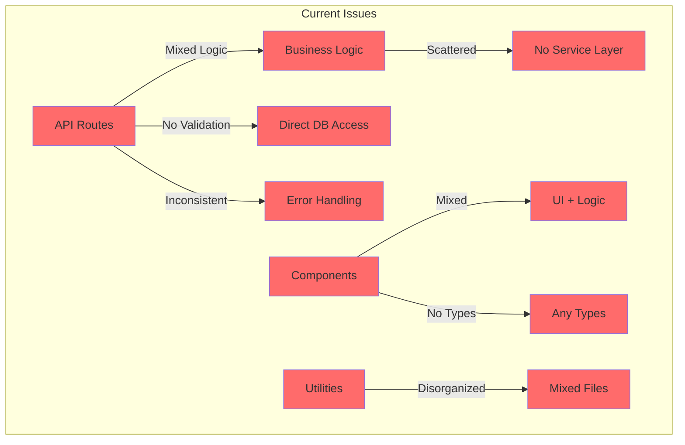

### Proposed Architecture

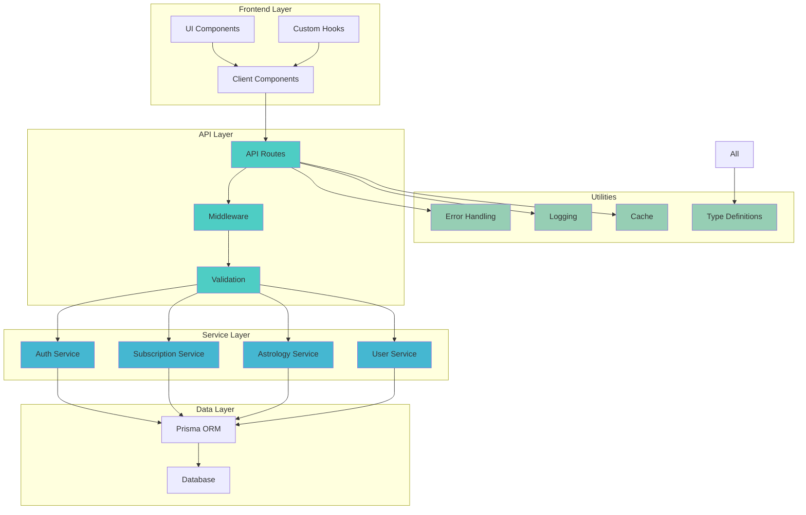

## Refactoring Flow

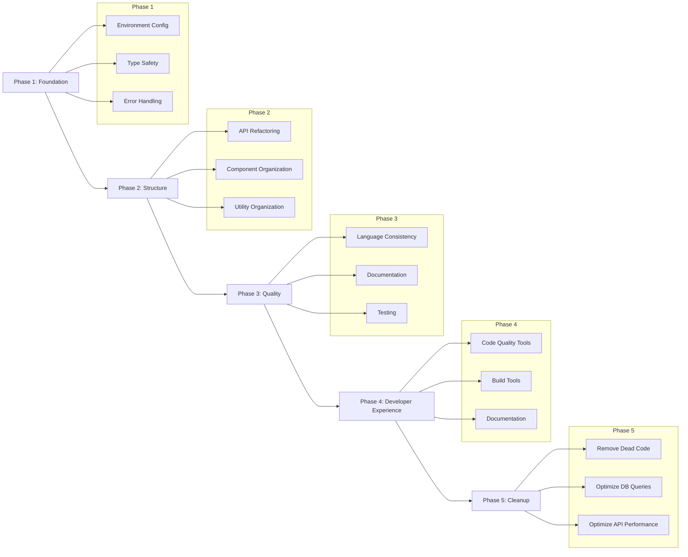

## API Request Flow (Proposed)

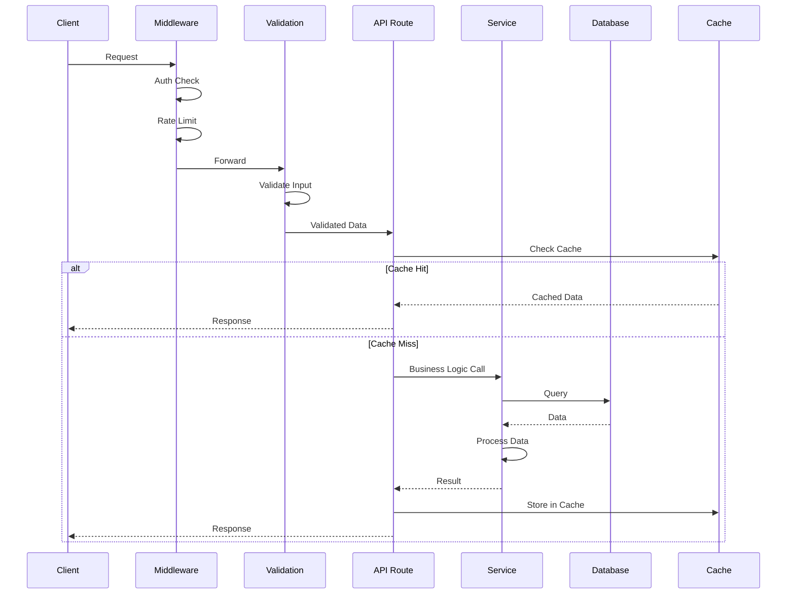

## Error Handling Flow (Proposed)

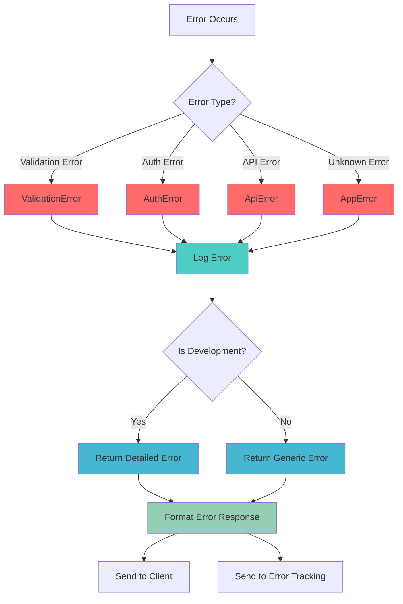

## Component Organization (Proposed)

```mermaid
graph TB
    subgraph components/
        A[features/]
        B[layout/]
        C[providers/]
        D[ui/]
    end

    subgraph features/
        A1[auth/]
        A2[astrology/]
        A3[subscription/]
    end

    subgraph auth/
        A1a[LoginForm]
        A1b[RegisterForm]
        A1c[ForgotPassword]
    end

    subgraph astrology/
        A2a[CartaNatal]
        A2b[CartaDraconica]
        A2c[Interpretacion]
    end

    subgraph subscription/
        A3a[SubscriptionCard]
        A3b[UpgradeModal]
        A3c[PricingTable]
    end

    subgraph layout/
        B1[Header]
        B2[Sidebar]
        B3[Footer]
        B4[Layout]
    end

    subgraph providers/
        C1[AuthProvider]
        C2[ThemeProvider]
        C3[QueryProvider]
    end

    subgraph ui/
        D1[Button]
        D2[Card]
        D3[Input]
        D4[Modal]
    end

    A --> A1
    A --> A2
    A --> A3
    A1 --> A1a
    A1 --> A1b
    A1 --> A1c
    A2 --> A2a
    A2 --> A2b
    A2 --> A2c
    A3 --> A3a
    A3 --> A3b
    A3 --> A3c
    B --> B1
    B --> B2
    B --> B3
    B --> B4
    C --> C1
    C --> C2
    C --> C3
    D --> D1
    D --> D2
    D --> D3
    D --> D4

    style A fill:#4ecdc4
    style B fill:#4ecdc4
    style C fill:#4ecdc4
    style D fill:#4ecdc4
```

## Type System Organization (Proposed)

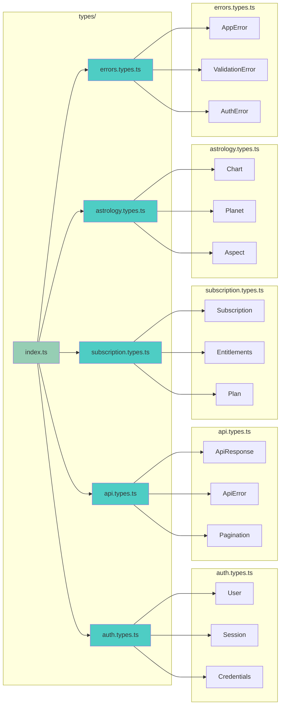

## Service Layer Organization (Proposed)

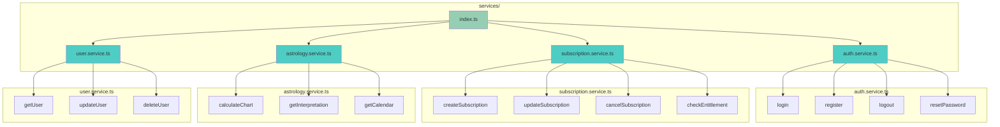

## Testing Strategy (Proposed)

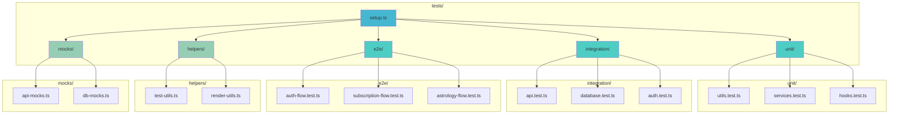

## CI/CD Pipeline (Proposed)

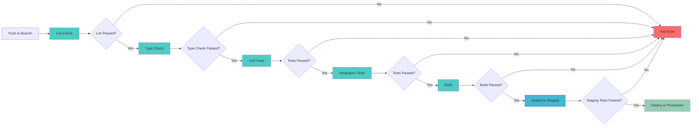

## Migration Path

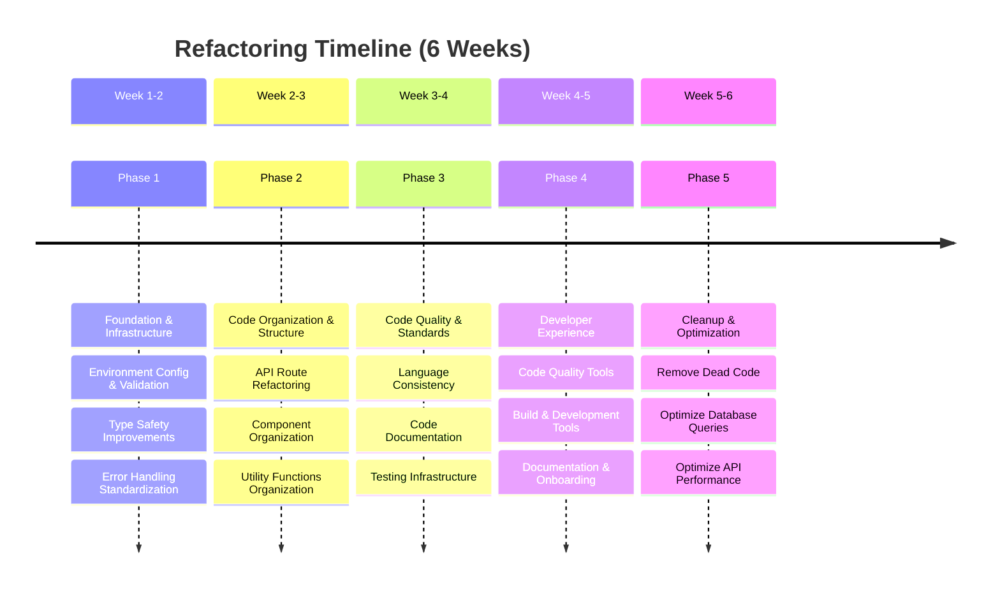

## Risk Mitigation Strategy

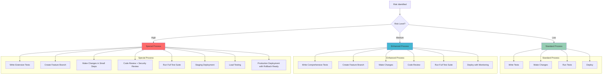
